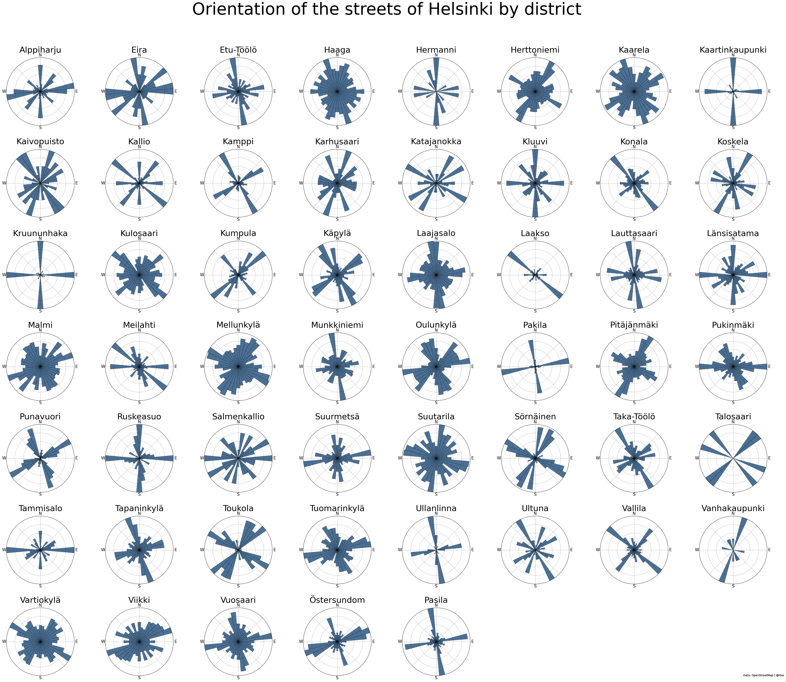
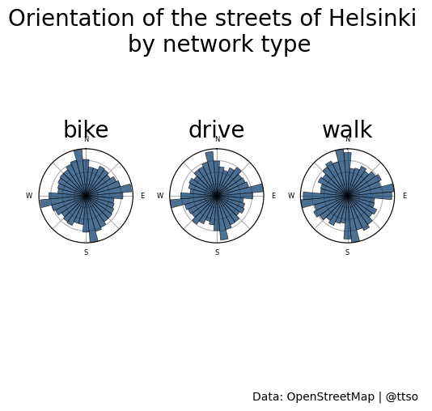

Visualizing street orientations of Helsinki with OSMnx
================
Tuija Sonkkila
2022-10-05

When I was doing an R Shiny [app of
streets](https://ttso.shinyapps.io/hkidistricts/) from the data by the
City of Helsinki, I found the Python library
[OSMnx](https://github.com/gboeing/osmnx) by Geoff Boeing, Urban
planning and spatial analysis professor at USC. His visualization of
[100 cities around the
world](https://geoffboeing.com/2018/07/city-street-orientations-world/)
is very nice and compact, so I decided to do the same from the 55
districts of Helsinki.

In my Windows laptop, I have the Anaconda package manager. From the
RStudio IDE I installed Python libraries with `conda_install` and even
defined `use_condaenv` although it is perhaps not necessary. That said,
the whole procedure of working with Python libraries with `reticulate`
is still somewhat hazy to me; my first try was with `py_install` but
although libraries seemed to have installed just fine, import failed.

``` r
library(reticulate)
conda_install(envname = "r-reticulate", packages= "osmnx")
use_condaenv("r-reticulate")
```

``` python
import numpy as np
import matplotlib.pyplot as plt
import osmnx as ox

ox.config(log_console = True, use_cache = True)
```

I am warned that the `ox.config` is soon history so this needs to be
changed at some point.

Caching proved to be a two-edged sword in my case. It saves time
dramatically but if there is an HTTP error, you can fall into an endless
loop. I did. The error message is cached too, and you cannot get rid of
it, or at least I don’t know how to do it. When you rerun the code, the
problematic item in the dictionary is encountered, the cached message
fetched, you get the same HTTP error again, it is cached etc. First I
thought that the district in question, Pasila, was too big and slow to
query but when run individually, all went smoothly. So I was forced to
handle Pasila separately.

Of course this could well be a novice user error.

First I needed all district names in a dictionary. The R dataframe is
there already but I suppose I cannot read it directly from a Python
chunk. So here with a CSV side step.

``` r
library(dplyr)
library(sf)
streets <- readRDS("streets.RDS")

districts <- streets %>% 
  st_drop_geometry() %>% 
  distinct(kaupunginosa) 

write.csv(districts, "districts.csv", row.names = FALSE, quote = FALSE)
```

In the dict comprehension where I define a dictionary, I tried to define
*skip the first row* because that’s the column name. This did not
succeed so I check the string value in the outer loop instead.

``` python
districts = {y: y + ', Helsinki, Finland' for y in [x for x in open('districts.csv').read().split('\n') if x ] if y != "kaupunginosa" }
```

Then, by trial and error, I realized that two districts do not have any
streets with the type `drive` so I needed to delete their keys,
otherwise the code breaks. Proper error handling would be the answer
here (I say to myself).

The core functionality of the plotting code below is verbatim from the
subroutine
[OSMnx_street_orientations.py](https://github.com/KBergermann/Urban-multiplex-networks/blob/2d3225edb50d8a0fab641f847adc8bdbcfc1d686/subroutines/OSMnx_street_orientations.py)
included in the `Urban-multiplex-networks` repository by [Kai
Bergermann](https://github.com/KBergermann).

The way I understand the code is that before the final data plotting
takes place, the code first allocates full columns and rows based on the
number of plots to-come, and draws the polar coordinates. However, plots
do not fill all slots in the last row, leaving few empty placeholders.

As a brute force solution, I hide these subplots. In my case, the last
four.

``` python
remove_keys = ('Suomenlinna', 'Mustikkamaa-Korkeasaari', 'Pasila')

for key in remove_keys:
    if key in districts:
        del districts[key]
        
n = len(districts)

ncols = int(np.ceil(np.sqrt(n)))
nrows = int(np.ceil(n / ncols))

figsize = (ncols * 5, nrows * 5)
fig, axes = plt.subplots(nrows, ncols, figsize = figsize, subplot_kw = {"projection": "polar"})

for ax, district in zip(axes.flat, sorted(districts.keys())):
  print(ox.utils.ts(), district)
  
  G = ox.graph_from_place(district, network_type = "drive")
  Gu = ox.add_edge_bearings(ox.get_undirected(G))
  fig, ax = ox.bearing.plot_orientation(Gu, ax = ax, title = district, area = False, title_font = {"family": "sans-serif", "fontsize": 30}, xtick_font = {"family": "sans-serif", "fontsize": 15})

axes.flat[-1].set_visible(False)
axes.flat[-2].set_visible(False)
axes.flat[-3].set_visible(False)
axes.flat[-4].set_visible(False)
```

And then the odd one, Pasila.

One another thing to learn at this point was, how to add the single
subplot to the `fig`? I can live with the fact that sorting by name
would be wrong with Pasila at the end. Maybe I could somehow rearrange
all subplots?

Anyway, the trick I learned when hiding subplots was using the index. So
I just add this new subplot to the end, and then make it visible again.
Programmatically not wise and looks a tad weird but will do this time.

``` python
P = ox.graph_from_place('Pasila, Helsinki, Finland', network_type = "drive")
Pu = ox.add_edge_bearings(ox.get_undirected(P))
fig, ax = ox.bearing.plot_orientation(Pu, title = 'Pasila', ax = axes.flat[-4], area = False, title_font = {"family": "sans-serif", "fontsize": 30}, xtick_font = {"family": "sans-serif", "fontsize": 15})

axes.flat[-4].set_visible(True)

fig.tight_layout()
fig.subplots_adjust(hspace = 0.35, top = 0.90)
fig.suptitle("Orientation of the streets of Helsinki by district", fontsize = 60)
fig.text(1, 0.01, "Data: OpenStreetMap | @ttso", ha = "right", fontsize = 10)

# fig.savefig("districts.pdf", facecolor = "w", dpi = 100, bbox_inches = "tight")
fig.savefig("districts.png", facecolor = "w", dpi = 100, bbox_inches = "tight")

plt.close()
```



How does the big picture look like in different street network types?
Which mode of moving brings you to most directions most often? I’d
assume walking… Physical facts draw hard limits though: Helsinki sits on
a cape.

``` python
types = ("drive", "walk", "bike")

fig, axes = plt.subplots(nrows = 1, ncols = 3, figsize = (5, 5), subplot_kw = {"projection": "polar"})

for ax, type in zip(axes.flat, sorted(types)):
  print(ox.utils.ts(), type)
  
  H = ox.graph_from_place("Helsinki, Finland", network_type = type)
  Hu = ox.add_edge_bearings(ox.get_undirected(H))
  fig, ax = ox.bearing.plot_orientation(Hu, ax = ax, title = type, area = False, title_font = {"family": "sans-serif", "fontsize": 20}, xtick_font = {"family": "sans-serif", "fontsize": 6})
  
fig.tight_layout()
fig.subplots_adjust(hspace = 0.35, top = 1)
fig.suptitle("Orientation of the streets of Helsinki \n by network type", fontsize = 20)
fig.text(1, 0.01, "Data: OpenStreetMap | @ttso", ha = "right", fontsize = 10)
fig.savefig("types.png", facecolor = "w", dpi = 100, bbox_inches = "tight")

plt.close()
```



You cannot compare relative frequencies of streets in one particular
compass bearing (orientation) between these three plots because the
scale is not the same. In other words, we cannot say that there are more
bike routes to the direction of “almost” North - between 120 and 90
degrees - than drive routes, although the bar is somewhat longer in the
bike plot. What we can say is that there are more bikes routes to that
direction than to North.

To do: add radial tick labels to show the scale.
